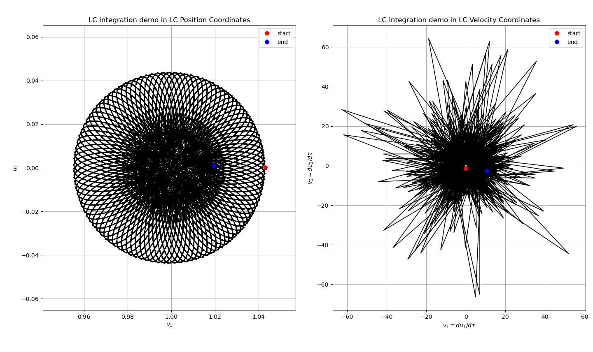
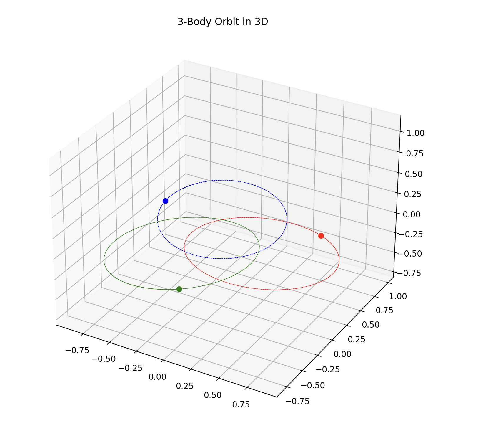
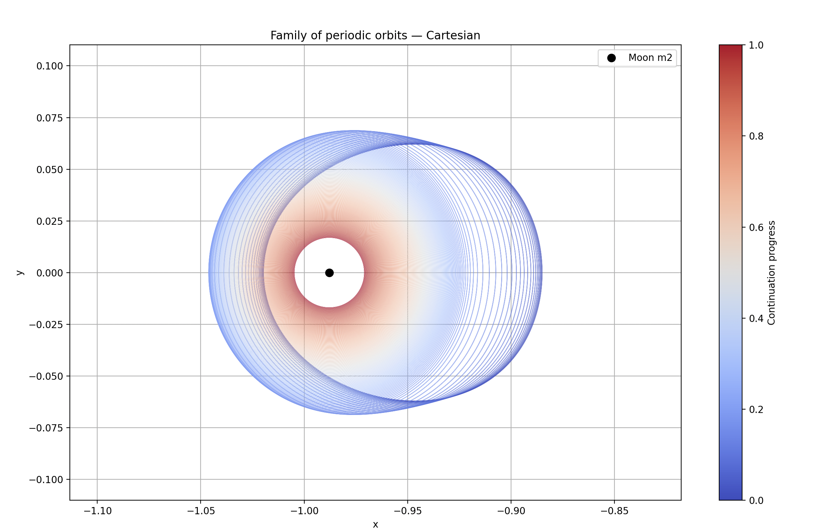
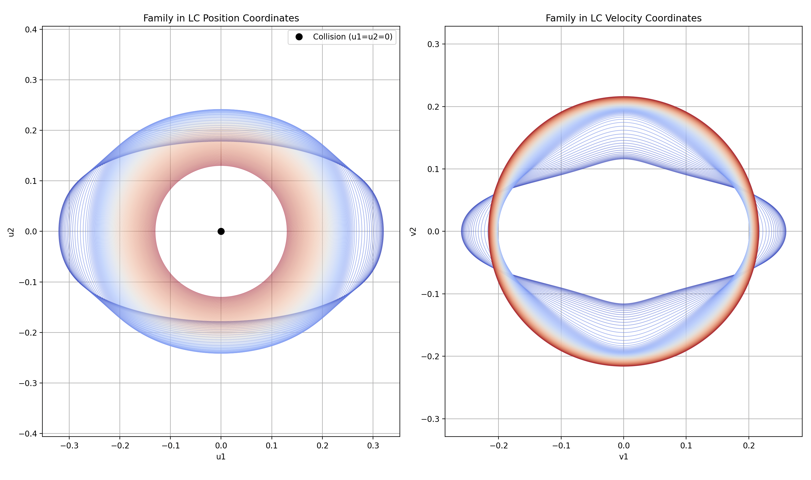

# Alex 

  
  
  

**Engineering Physics (3rd year) @ Uppsala University**  
I build things at the intersection of **scientific computing**, **applied ML**, and **engineering problem-solving**.

- Studying Engineering Physics at Uppsala University  
- Teaching Assistant & piano instructor  
- Student representative (ENLIGHT)  
- Co-founder of **SPEKTAKEL** (student platform/project)
- Research Assistant on Celestial Mechanics

## Some of my current/past research- and course work

  

  
   <em>Pressure field simulation using SBP operators as well as RK4</em>

<table>
  <tr>
    <td align="center" width="50%">
      
       <em>3-body chaotic simulation example in LC-regularized coordinates</em>
    </td>
    <td align="center" width="50%">
      
       <em>3-body Lagrange Unit Circle solution</em>
    </td>
  </tr>

  <tr>
    <td align="center" width="50%">
      
       <em>Family of solutions approaching collision with the m2 primary (the moon) in cartesian coordinates</em>
    </td>
    <td align="center" width="50%">
      
       <em>Family of solutions approaching collision with the m2 primary (the moon) in Levi Civita regularized coordinates (found using pseudo-arclength continuation)</em>
    </td>
  </tr>
</table>

## Tech I often use

**Languages:** Python, MATLAB, C/C++, Java Script  
**Tools:** NumPy, SciPy, Matplotlib, LaTeX, React, PyTorch, Scikit
**Focus:** numerical linear algebra, simulation, optimization, machine learning, partial differential equations

### Contact
- LinkedIn: https://www.linkedin.com/in/alexander-cremer-b733aa2a2/
- Email: alexander.cremer.1041@student.uu.se
